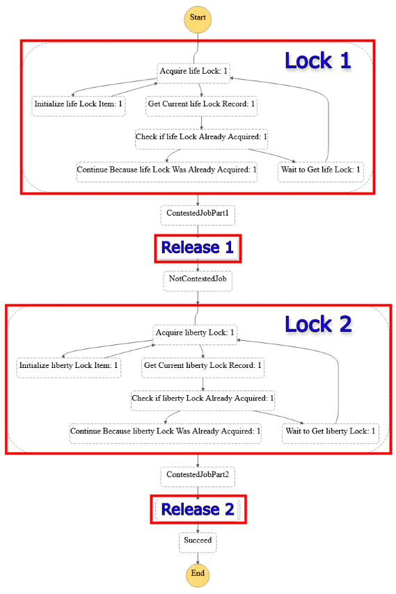

# @dontirun/state-machine-semaphore

[](https://img.shields.io/npm/v/@dontirun/state-machine-semaphore)
[](https://pypi.org/project/state-machine-semaphore)
[](https://www.nuget.org/packages/Dontirun.StateMachineSemaphore)
[](https://search.maven.org/artifact/io.github.dontirun/statemachinesemaphore)
[](https://github.com/dontirun/state-machine-semaphore-go)

[](https://constructs.dev/packages/@dontirun/state-machine-semaphore)

An [aws-cdk](https://github.com/aws/aws-cdk) construct that enables you to use AWS Step Functions to control concurrency in your distributed system. You can use this construct to distributed state machine semaphores to control concurrent invocations of contentious work.

This construct is based off of [Justin Callison's](https://github.com/JustinCallison) example [code](https://github.com/aws-samples/aws-stepfunctions-examples/blob/main/sam/app-control-concurrency-with-dynamodb/statemachines/dynamodb-semaphore.asl.json). Make sure to check out Justin's [blogpost](https://aws.amazon.com/blogs/compute/controlling-concurrency-in-distributed-systems-using-aws-step-functions/) to learn about how the system works.

## Examples

### Example 1) A state machine with a controlled job

<details>

<summary>Click to see code</summary>

```typescript
import { Function } from 'aws-cdk-lib/aws-lambda';
import { Duration, Stack, StackProps } from 'aws-cdk-lib';
import { StateMachine, Succeed, Wait, WaitTime } from 'aws-cdk-lib/aws-stepfunctions';
import { LambdaInvoke } from 'aws-cdk-lib/aws-stepfunctions-tasks';
import { Construct } from 'constructs';
import { Semaphore } from '@dontirun/state-machine-semaphore';


export class CdkTestStack extends Stack {
  constructor(scope: Construct, id: string, props?: StackProps) {
    super(scope, id, props);

    const contestedJob = new LambdaInvoke(this, 'ContestedJobPart1', {
      lambdaFunction: Function.fromFunctionName(this, 'JobFunctionPart1', 'cool-function'),
    }).next(new Wait(this, 'Wait', { time: WaitTime.duration(Duration.seconds(7)) }))
      .next(new Wait(this, 'AnotherWait', { time: WaitTime.duration(Duration.seconds(7)) }))
      .next(new Wait(this, 'YetAnotherWait', { time: WaitTime.duration(Duration.seconds(7)) }));

    const afterContestedJob = new Succeed(this, 'Succeed');

    const stateMachineFragment = new Semaphore(stack, 'Semaphore', { lockName: 'life', limit: 42, job: contestedJob, nextState: afterContestedJob });

    new StateMachine(this, 'StateMachine', {
      definition: stateMachineFragment,
    });
  }
}
```

</details>


<details>

<summary>Click to see the state machine definition</summary>


</details>


### Example 2) A state machine with multiple semaphores

<details>

<summary>Click to see code</summary>

```typescript
import { Function } from 'aws-cdk-lib/aws-lambda';
import { Duration, Stack, StackProps } from 'aws-cdk-lib';
import { StateMachine, Succeed, Wait, WaitTime } from 'aws-cdk-lib/aws-stepfunctions';
import { LambdaInvoke } from 'aws-cdk-lib/aws-stepfunctions-tasks';
import { Construct } from 'constructs';
import { Semaphore } from '@dontirun/state-machine-semaphore';


export class CdkTestStack extends Stack {
  constructor(scope: Construct, id: string, props?: StackProps) {
    super(scope, id, props);

    const contestedJob = new LambdaInvoke(this, 'ContestedJobPart1', {
      lambdaFunction: Function.fromFunctionName(this, 'JobFunctionPart1', 'cool-function'),
    })
    const notContestedJob = new LambdaInvoke(this, 'NotContestedJob', {
      lambdaFunction: Function.fromFunctionName(this, 'NotContestedJobFunction', 'cooler-function'),
    })
    const contestedJob2 = new LambdaInvoke(this, 'ContestedJobPart2', {
      lambdaFunction: Function.fromFunctionName(this, 'JobFunctionPart2', 'coolest-function'),
    })
    const afterContestedJob2 = new Succeed(this, 'Succeed');

    const definition = new Semaphore(stack, 'Semaphore', { lockName: 'life', limit: 42, job: contestedJob, nextState: notContestedJob })
      .next(new Semaphore(stack, 'Semaphore2', { lockName: 'liberty', limit: 7, job: contestedJob2, nextState: afterContestedJob2 }));

    new StateMachine(this, 'StateMachine', {
      definition: definition,
    });
  }
}
```

</details>

<details>

<summary>Click to see the state machine definition</summary>


</details>

## API Reference

See [API.md](./API.md).

## License

This project is licensed under the Apache-2.0 License.

# API Reference <a name="API Reference" id="api-reference"></a>

## Constructs <a name="Constructs" id="Constructs"></a>

### Semaphore <a name="Semaphore" id="@dontirun/state-machine-semaphore.Semaphore"></a>

Generates a semaphore for a StepFunction job (or chained set of jobs) to limit parallelism across executions.

#### Initializers <a name="Initializers" id="@dontirun/state-machine-semaphore.Semaphore.Initializer"></a>

```typescript
import { Semaphore } from '@dontirun/state-machine-semaphore'

new Semaphore(scope: Construct, id: string, props: SemaphoreProps)
```

| **Name** | **Type** | **Description** |
| --- | --- | --- |
| <code><a href="#@dontirun/state-machine-semaphore.Semaphore.Initializer.parameter.scope">scope</a></code> | <code>constructs.Construct</code> | *No description.* |
| <code><a href="#@dontirun/state-machine-semaphore.Semaphore.Initializer.parameter.id">id</a></code> | <code>string</code> | *No description.* |
| <code><a href="#@dontirun/state-machine-semaphore.Semaphore.Initializer.parameter.props">props</a></code> | <code><a href="#@dontirun/state-machine-semaphore.SemaphoreProps">SemaphoreProps</a></code> | *No description.* |

---

##### `scope`<sup>Required</sup> <a name="scope" id="@dontirun/state-machine-semaphore.Semaphore.Initializer.parameter.scope"></a>

- *Type:* constructs.Construct

---

##### `id`<sup>Required</sup> <a name="id" id="@dontirun/state-machine-semaphore.Semaphore.Initializer.parameter.id"></a>

- *Type:* string

---

##### `props`<sup>Required</sup> <a name="props" id="@dontirun/state-machine-semaphore.Semaphore.Initializer.parameter.props"></a>

- *Type:* <a href="#@dontirun/state-machine-semaphore.SemaphoreProps">SemaphoreProps</a>

---

#### Methods <a name="Methods" id="Methods"></a>

| **Name** | **Description** |
| --- | --- |
| <code><a href="#@dontirun/state-machine-semaphore.Semaphore.toString">toString</a></code> | Returns a string representation of this construct. |
| <code><a href="#@dontirun/state-machine-semaphore.Semaphore.next">next</a></code> | Continue normal execution with the given state. |
| <code><a href="#@dontirun/state-machine-semaphore.Semaphore.prefixStates">prefixStates</a></code> | Prefix the IDs of all states in this state machine fragment. |
| <code><a href="#@dontirun/state-machine-semaphore.Semaphore.toSingleState">toSingleState</a></code> | Wrap all states in this state machine fragment up into a single state. |

---

##### `toString` <a name="toString" id="@dontirun/state-machine-semaphore.Semaphore.toString"></a>

```typescript
public toString(): string
```

Returns a string representation of this construct.

##### `next` <a name="next" id="@dontirun/state-machine-semaphore.Semaphore.next"></a>

```typescript
public next(next: IChainable): Chain
```

Continue normal execution with the given state.

###### `next`<sup>Required</sup> <a name="next" id="@dontirun/state-machine-semaphore.Semaphore.next.parameter.next"></a>

- *Type:* aws-cdk-lib.aws_stepfunctions.IChainable

---

##### `prefixStates` <a name="prefixStates" id="@dontirun/state-machine-semaphore.Semaphore.prefixStates"></a>

```typescript
public prefixStates(prefix?: string): StateMachineFragment
```

Prefix the IDs of all states in this state machine fragment.

Use this to avoid multiple copies of the state machine all having the
same state IDs.

###### `prefix`<sup>Optional</sup> <a name="prefix" id="@dontirun/state-machine-semaphore.Semaphore.prefixStates.parameter.prefix"></a>

- *Type:* string

The prefix to add.

Will use construct ID by default.

---

##### `toSingleState` <a name="toSingleState" id="@dontirun/state-machine-semaphore.Semaphore.toSingleState"></a>

```typescript
public toSingleState(options?: SingleStateOptions): Parallel
```

Wrap all states in this state machine fragment up into a single state.

This can be used to add retry or error handling onto this state
machine fragment.

Be aware that this changes the result of the inner state machine
to be an array with the result of the state machine in it. Adjust
your paths accordingly. For example, change 'outputPath' to
'$[0]'.

###### `options`<sup>Optional</sup> <a name="options" id="@dontirun/state-machine-semaphore.Semaphore.toSingleState.parameter.options"></a>

- *Type:* aws-cdk-lib.aws_stepfunctions.SingleStateOptions

---

#### Static Functions <a name="Static Functions" id="Static Functions"></a>

| **Name** | **Description** |
| --- | --- |
| <code><a href="#@dontirun/state-machine-semaphore.Semaphore.isConstruct">isConstruct</a></code> | Checks if `x` is a construct. |

---

##### ~~`isConstruct`~~ <a name="isConstruct" id="@dontirun/state-machine-semaphore.Semaphore.isConstruct"></a>

```typescript
import { Semaphore } from '@dontirun/state-machine-semaphore'

Semaphore.isConstruct(x: any)
```

Checks if `x` is a construct.

###### `x`<sup>Required</sup> <a name="x" id="@dontirun/state-machine-semaphore.Semaphore.isConstruct.parameter.x"></a>

- *Type:* any

Any object.

---

#### Properties <a name="Properties" id="Properties"></a>

| **Name** | **Type** | **Description** |
| --- | --- | --- |
| <code><a href="#@dontirun/state-machine-semaphore.Semaphore.property.node">node</a></code> | <code>constructs.Node</code> | The tree node. |
| <code><a href="#@dontirun/state-machine-semaphore.Semaphore.property.endStates">endStates</a></code> | <code>aws-cdk-lib.aws_stepfunctions.INextable[]</code> | The states to chain onto if this fragment is used. |
| <code><a href="#@dontirun/state-machine-semaphore.Semaphore.property.id">id</a></code> | <code>string</code> | Descriptive identifier for this chainable. |
| <code><a href="#@dontirun/state-machine-semaphore.Semaphore.property.startState">startState</a></code> | <code>aws-cdk-lib.aws_stepfunctions.State</code> | The start state of this state machine fragment. |

---

##### `node`<sup>Required</sup> <a name="node" id="@dontirun/state-machine-semaphore.Semaphore.property.node"></a>

```typescript
public readonly node: Node;
```

- *Type:* constructs.Node

The tree node.

---

##### `endStates`<sup>Required</sup> <a name="endStates" id="@dontirun/state-machine-semaphore.Semaphore.property.endStates"></a>

```typescript
public readonly endStates: INextable[];
```

- *Type:* aws-cdk-lib.aws_stepfunctions.INextable[]

The states to chain onto if this fragment is used.

---

##### `id`<sup>Required</sup> <a name="id" id="@dontirun/state-machine-semaphore.Semaphore.property.id"></a>

```typescript
public readonly id: string;
```

- *Type:* string

Descriptive identifier for this chainable.

---

##### `startState`<sup>Required</sup> <a name="startState" id="@dontirun/state-machine-semaphore.Semaphore.property.startState"></a>

```typescript
public readonly startState: State;
```

- *Type:* aws-cdk-lib.aws_stepfunctions.State

The start state of this state machine fragment.

---


## Structs <a name="Structs" id="Structs"></a>

### SemaphoreProps <a name="SemaphoreProps" id="@dontirun/state-machine-semaphore.SemaphoreProps"></a>

Interface for creating a Semaphore.

#### Initializer <a name="Initializer" id="@dontirun/state-machine-semaphore.SemaphoreProps.Initializer"></a>

```typescript
import { SemaphoreProps } from '@dontirun/state-machine-semaphore'

const semaphoreProps: SemaphoreProps = { ... }
```

#### Properties <a name="Properties" id="Properties"></a>

| **Name** | **Type** | **Description** |
| --- | --- | --- |
| <code><a href="#@dontirun/state-machine-semaphore.SemaphoreProps.property.job">job</a></code> | <code><a href="#@dontirun/state-machine-semaphore.IChainNextable">IChainNextable</a></code> | The job (or chained jobs) to be semaphored. |
| <code><a href="#@dontirun/state-machine-semaphore.SemaphoreProps.property.limit">limit</a></code> | <code>number</code> | The maximum number of concurrent executions for the given lock. |
| <code><a href="#@dontirun/state-machine-semaphore.SemaphoreProps.property.lockName">lockName</a></code> | <code>string</code> | The name of the semaphore. |
| <code><a href="#@dontirun/state-machine-semaphore.SemaphoreProps.property.nextState">nextState</a></code> | <code>aws-cdk-lib.aws_stepfunctions.State</code> | The State to go to after the semaphored job completes. |
| <code><a href="#@dontirun/state-machine-semaphore.SemaphoreProps.property.comments">comments</a></code> | <code>boolean</code> | Add detailed comments to lock related states. |
| <code><a href="#@dontirun/state-machine-semaphore.SemaphoreProps.property.reuseLock">reuseLock</a></code> | <code>boolean</code> | Explicility allow the reuse of a named lock from a previously generated job. |
| <code><a href="#@dontirun/state-machine-semaphore.SemaphoreProps.property.tableReadWriteCapacity">tableReadWriteCapacity</a></code> | <code><a href="#@dontirun/state-machine-semaphore.TableReadWriteCapacity">TableReadWriteCapacity</a></code> | Optionally set the DynamoDB table to have a specific read/write capacity with PROVISIONED billing. |

---

##### `job`<sup>Required</sup> <a name="job" id="@dontirun/state-machine-semaphore.SemaphoreProps.property.job"></a>

```typescript
public readonly job: IChainNextable;
```

- *Type:* <a href="#@dontirun/state-machine-semaphore.IChainNextable">IChainNextable</a>

The job (or chained jobs) to be semaphored.

---

##### `limit`<sup>Required</sup> <a name="limit" id="@dontirun/state-machine-semaphore.SemaphoreProps.property.limit"></a>

```typescript
public readonly limit: number;
```

- *Type:* number

The maximum number of concurrent executions for the given lock.

---

##### `lockName`<sup>Required</sup> <a name="lockName" id="@dontirun/state-machine-semaphore.SemaphoreProps.property.lockName"></a>

```typescript
public readonly lockName: string;
```

- *Type:* string

The name of the semaphore.

---

##### `nextState`<sup>Required</sup> <a name="nextState" id="@dontirun/state-machine-semaphore.SemaphoreProps.property.nextState"></a>

```typescript
public readonly nextState: State;
```

- *Type:* aws-cdk-lib.aws_stepfunctions.State

The State to go to after the semaphored job completes.

---

##### `comments`<sup>Optional</sup> <a name="comments" id="@dontirun/state-machine-semaphore.SemaphoreProps.property.comments"></a>

```typescript
public readonly comments: boolean;
```

- *Type:* boolean

Add detailed comments to lock related states.

Significantly increases CloudFormation template size. Default: false.

---

##### `reuseLock`<sup>Optional</sup> <a name="reuseLock" id="@dontirun/state-machine-semaphore.SemaphoreProps.property.reuseLock"></a>

```typescript
public readonly reuseLock: boolean;
```

- *Type:* boolean

Explicility allow the reuse of a named lock from a previously generated job.

Throws an error if a different `limit` is specified. Default: false.

---

##### `tableReadWriteCapacity`<sup>Optional</sup> <a name="tableReadWriteCapacity" id="@dontirun/state-machine-semaphore.SemaphoreProps.property.tableReadWriteCapacity"></a>

```typescript
public readonly tableReadWriteCapacity: TableReadWriteCapacity;
```

- *Type:* <a href="#@dontirun/state-machine-semaphore.TableReadWriteCapacity">TableReadWriteCapacity</a>
- *Default:* PAY_PER_REQUEST

Optionally set the DynamoDB table to have a specific read/write capacity with PROVISIONED billing.

Note: This property can only be set on the first instantiation of a `Semaphore` per stack

---

### TableReadWriteCapacity <a name="TableReadWriteCapacity" id="@dontirun/state-machine-semaphore.TableReadWriteCapacity"></a>

Read and write capacity for a PROVISIONED billing DynamoDB table.

#### Initializer <a name="Initializer" id="@dontirun/state-machine-semaphore.TableReadWriteCapacity.Initializer"></a>

```typescript
import { TableReadWriteCapacity } from '@dontirun/state-machine-semaphore'

const tableReadWriteCapacity: TableReadWriteCapacity = { ... }
```

#### Properties <a name="Properties" id="Properties"></a>

| **Name** | **Type** | **Description** |
| --- | --- | --- |
| <code><a href="#@dontirun/state-machine-semaphore.TableReadWriteCapacity.property.readCapacity">readCapacity</a></code> | <code>number</code> | *No description.* |
| <code><a href="#@dontirun/state-machine-semaphore.TableReadWriteCapacity.property.writeCapacity">writeCapacity</a></code> | <code>number</code> | *No description.* |

---

##### `readCapacity`<sup>Required</sup> <a name="readCapacity" id="@dontirun/state-machine-semaphore.TableReadWriteCapacity.property.readCapacity"></a>

```typescript
public readonly readCapacity: number;
```

- *Type:* number

---

##### `writeCapacity`<sup>Required</sup> <a name="writeCapacity" id="@dontirun/state-machine-semaphore.TableReadWriteCapacity.property.writeCapacity"></a>

```typescript
public readonly writeCapacity: number;
```

- *Type:* number

---


## Protocols <a name="Protocols" id="Protocols"></a>

### IChainNextable <a name="IChainNextable" id="@dontirun/state-machine-semaphore.IChainNextable"></a>

- *Extends:* aws-cdk-lib.aws_stepfunctions.IChainable, aws-cdk-lib.aws_stepfunctions.INextable

- *Implemented By:* <a href="#@dontirun/state-machine-semaphore.IChainNextable">IChainNextable</a>


#### Properties <a name="Properties" id="Properties"></a>

| **Name** | **Type** | **Description** |
| --- | --- | --- |
| <code><a href="#@dontirun/state-machine-semaphore.IChainNextable.property.endStates">endStates</a></code> | <code>aws-cdk-lib.aws_stepfunctions.INextable[]</code> | The chainable end state(s) of this chainable. |
| <code><a href="#@dontirun/state-machine-semaphore.IChainNextable.property.id">id</a></code> | <code>string</code> | Descriptive identifier for this chainable. |
| <code><a href="#@dontirun/state-machine-semaphore.IChainNextable.property.startState">startState</a></code> | <code>aws-cdk-lib.aws_stepfunctions.State</code> | The start state of this chainable. |

---

##### `endStates`<sup>Required</sup> <a name="endStates" id="@dontirun/state-machine-semaphore.IChainNextable.property.endStates"></a>

```typescript
public readonly endStates: INextable[];
```

- *Type:* aws-cdk-lib.aws_stepfunctions.INextable[]

The chainable end state(s) of this chainable.

---

##### `id`<sup>Required</sup> <a name="id" id="@dontirun/state-machine-semaphore.IChainNextable.property.id"></a>

```typescript
public readonly id: string;
```

- *Type:* string

Descriptive identifier for this chainable.

---

##### `startState`<sup>Required</sup> <a name="startState" id="@dontirun/state-machine-semaphore.IChainNextable.property.startState"></a>

```typescript
public readonly startState: State;
```

- *Type:* aws-cdk-lib.aws_stepfunctions.State

The start state of this chainable.

---

