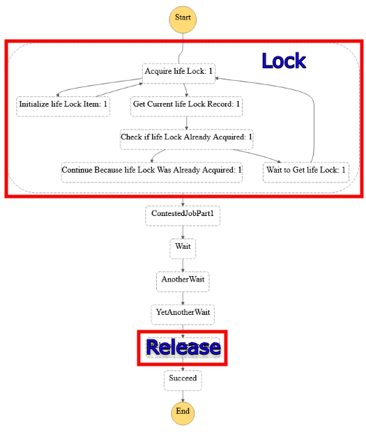
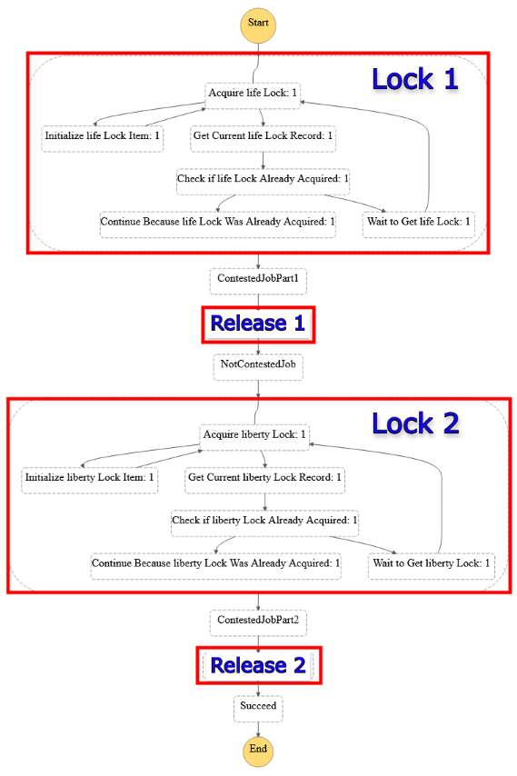

# @dontirun/state-machine-semaphore

[](https://img.shields.io/npm/v/@dontirun/state-machine-semaphore) 
[](https://pypi.org/project/state-machine-semaphore)
[](https://www.nuget.org/packages/Dontirun.StateMachineSemaphore)
[](https://search.maven.org/artifact/io.github.dontirun/statemachinesemaphore)
[](https://www.nuget.org/packages/Dontirun.StateMachineSemaphore)

[](https://constructs.dev/packages/@dontirun/state-machine-semaphore)

An [aws-cdk](https://github.com/aws/aws-cdk) construct that enables you to use AWS Step Functions to control concurrency in your distributed system. You can use this construct to distributed state machine semaphores to control concurrent invocations of contentious work.

This construct is based off of [Justin Callison's](https://github.com/JustinCallison) example [code](https://github.com/aws-samples/aws-stepfunctions-examples/blob/main/sam/app-control-concurrency-with-dynamodb/statemachines/dynamodb-semaphore.asl.json). Make sure to check out Justin's [blogpost](https://aws.amazon.com/blogs/compute/controlling-concurrency-in-distributed-systems-using-aws-step-functions/) to learn about how the system works.

## Examples

### Example 1) A state machine with a controlled job

<details>

<summary>Click to see code</summary>

```typescript
import { Function } from 'aws-cdk-lib/aws-lambda'; 
import { Duration, Stack, StackProps } from 'aws-cdk-lib';
import { StateMachine, Succeed, Wait, WaitTime } from 'aws-cdk-lib/aws-stepfunctions';
import { LambdaInvoke } from 'aws-cdk-lib/aws-stepfunctions-tasks';
import { Construct } from 'constructs';
import { Semaphore } from '@dontirun/state-machine-semaphore';


export class CdkTestStack extends Stack {
  constructor(scope: Construct, id: string, props?: StackProps) {
    super(scope, id, props);

    const contestedJob = new LambdaInvoke(this, 'ContestedJobPart1', {
      lambdaFunction: Function.fromFunctionName(this, 'JobFunctionPart1', 'cool-function'),
    }).next(new Wait(this, 'Wait', { time: WaitTime.duration(Duration.seconds(7)) }))
      .next(new Wait(this, 'AnotherWait', { time: WaitTime.duration(Duration.seconds(7)) }))
      .next(new Wait(this, 'YetAnotherWait', { time: WaitTime.duration(Duration.seconds(7)) }));

    const afterContestedJob = new Succeed(this, 'Succeed');

    const stateMachineFragment = new Semaphore(stack, 'Semaphore', { lockName: 'life', limit: 42, job: contestedJob, nextState: afterContestedJob });
    
    new StateMachine(this, 'StateMachine', {
      definition: stateMachineFragment,
    });
  }
}
```

</details>


<details>

<summary>Click to see the state machine definition</summary>


</details>


### Example 2) A state machine with multiple semaphores

<details>

<summary>Click to see code</summary>

```typescript
import { Function } from 'aws-cdk-lib/aws-lambda'; 
import { Duration, Stack, StackProps } from 'aws-cdk-lib';
import { StateMachine, Succeed, Wait, WaitTime } from 'aws-cdk-lib/aws-stepfunctions';
import { LambdaInvoke } from 'aws-cdk-lib/aws-stepfunctions-tasks';
import { Construct } from 'constructs';
import { Semaphore } from '@dontirun/state-machine-semaphore';


export class CdkTestStack extends Stack {
  constructor(scope: Construct, id: string, props?: StackProps) {
    super(scope, id, props);

    const contestedJob = new LambdaInvoke(this, 'ContestedJobPart1', {
      lambdaFunction: Function.fromFunctionName(this, 'JobFunctionPart1', 'cool-function'),
    })
    const notContestedJob = new LambdaInvoke(this, 'NotContestedJob', {
      lambdaFunction: Function.fromFunctionName(this, 'NotContestedJobFunction', 'cooler-function'),
    })
    const contestedJob2 = new LambdaInvoke(this, 'ContestedJobPart2', {
      lambdaFunction: Function.fromFunctionName(this, 'JobFunctionPart2', 'coolest-function'),
    })
    const afterContestedJob2 = new Succeed(this, 'Succeed');

    const definition = new Semaphore(stack, 'Semaphore', { lockName: 'life', limit: 42, job: contestedJob, nextState: notContestedJob })
      .next(new Semaphore(stack, 'Semaphore2', { lockName: 'liberty', limit: 7, job: contestedJob2, nextState: afterContestedJob2 }));

    new StateMachine(this, 'StateMachine', {
      definition: definition,
    });
  }
}
```

</details>

<details>

<summary>Click to see the state machine definition</summary>


</details>

## API Reference

See [API.md](./API.md).

## License

This project is licensed under the Apache-2.0 License.
